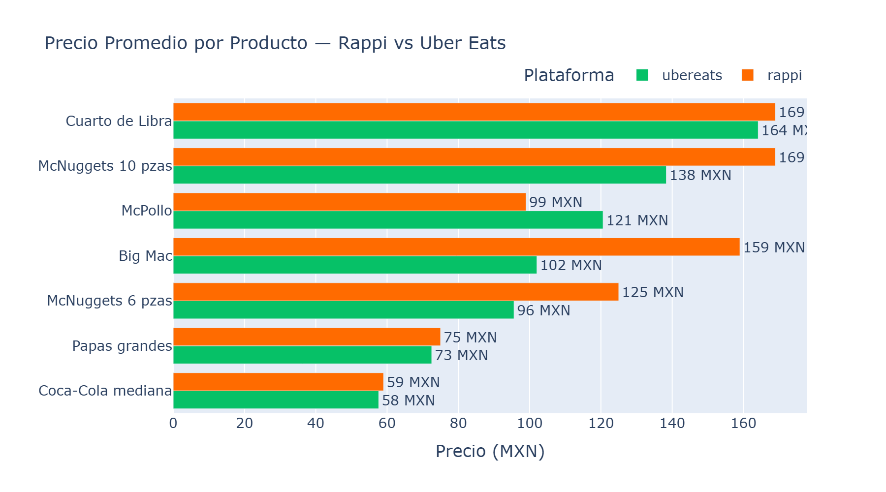
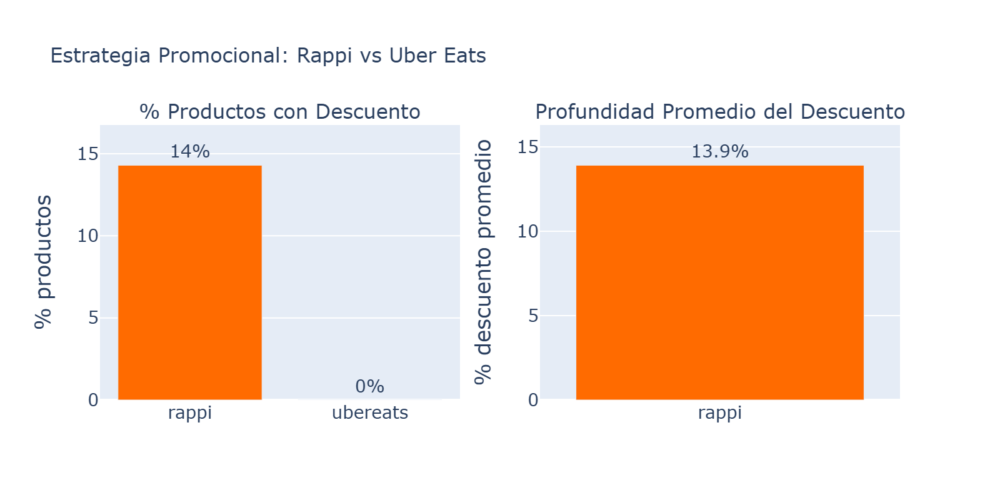
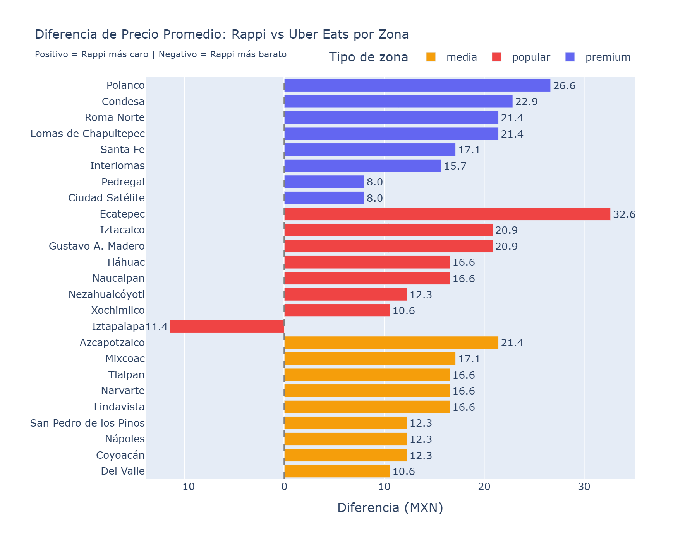
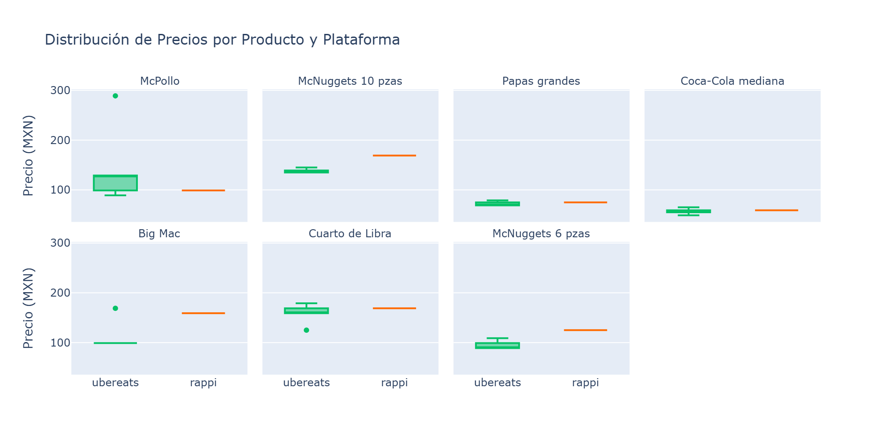
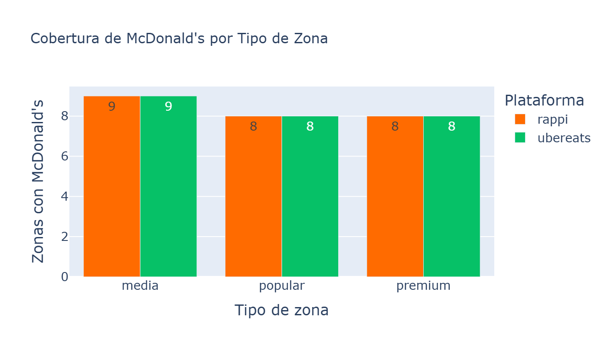

# Informe de Competitive Intelligence — Delivery CDMX

**Fecha:** 2026-03-29 03:56 UTC
**Plataformas:** Rappi, Uber Eats
**Zonas:** 25 (8 premium, 9 media, 8 popular)
**Productos benchmark:** 7 items de McDonald's
**Data points:** 344 observaciones

---

## Resumen Ejecutivo

El análisis de 344 data points recolectados en 25 zonas de la CDMX revela que **Rappi es en promedio 14.4% más caro que Uber Eats** en productos de McDonald's. Sin embargo, Rappi compensa con una **estrategia promocional significativamente más agresiva** (descuentos en 14% de sus productos vs 0% en Uber Eats).

**Hallazgos clave:**
- Rappi tiene precios base más altos en 6 de 7 productos comparados
- Uber Eats muestra mayor variación de precios entre sucursales (24 tiendas diferentes vs 1 en Rappi)
- Ambas plataformas ofrecen envío gratuito en McDonald's CDMX
- No se detectan diferencias significativas de precios entre zonas premium, media y popular

---

## Top 5 Insights Accionables

### Insight 1: Rappi tiene precios base más altos en productos estrella

**Finding:** El Big Mac en Rappi cuesta $159 MXN vs $102 MXN promedio en Uber Eats — una diferencia de 56%. Los McNuggets 6 piezas muestran una brecha similar: $125 vs $96 MXN (31% más caro).

**Impacto:** Los consumidores que comparan precios antes de ordenar migrarán hacia Uber Eats para estos productos de alto volumen. El Big Mac es el producto insignia de McDonald's y el principal driver de tráfico.

**Recomendación:** Negociar con McDonald's una equiparación de precios base en los 3-5 productos más populares, o implementar subsidios selectivos que igualen el precio final al consumidor.

---

### Insight 2: Rappi compensa precios altos con promociones agresivas

**Finding:** 14% de los productos monitoreados en Rappi tienen descuento activo, con una profundidad promedio de 13.9%. En contraste, Uber Eats muestra descuentos en solo 0% de sus productos. Rappi ofrece promociones como McTrío McTocino a $69 (-57%) y McFlurry Oreo a $29 (-51%).

**Impacto:** La estrategia de "precio alto + descuento visible" genera una percepción de valor y urgencia que puede ser más efectiva para conversión que precios bajos constantes. Sin embargo, puede erosionar la confianza si los consumidores perciben los precios "originales" como inflados.

**Recomendación:** Monitorear si la tasa de conversión de usuarios con descuento es significativamente mayor. Considerar un modelo híbrido: precios competitivos en productos core + descuentos en combos y complementos.

---

### Insight 3: Uber Eats tiene mayor granularidad geográfica

**Finding:** Uber Eats asigna sucursales específicas según la ubicación del usuario (24 sucursales diferentes para 25 zonas), mientras que Rappi parece asignar una sucursal genérica en la mayoría de zonas. Esto permite a Uber Eats ofrecer **precios y menús adaptados por sucursal**, con variaciones de hasta $106 MXN en un mismo producto.

**Impacto:** La granularidad geográfica de Uber Eats les permite optimizar tiempos de entrega y adaptar ofertas localmente. Rappi pierde oportunidad de pricing dinámico por zona.

**Recomendación:** Implementar asignación inteligente de sucursales basada en proximidad real, y explorar pricing diferenciado por sucursal para competir con Uber Eats en zonas específicas.

---

### Insight 4: No hay diferenciación de precios por nivel socioeconómico

**Finding:** Contrariamente a lo esperado, no se detectan diferencias significativas de precios entre zonas premium (ej. Polanco, Lomas), media (Del Valle, Coyoacán) y popular (Iztapalapa, Ecatepec) en ninguna de las dos plataformas. El precio promedio en zonas premium es $114 MXN vs $115 MXN en zonas populares.

**Impacto:** Existe una oportunidad no explotada de pricing dinámico basado en zona. Los consumidores en zonas premium típicamente tienen mayor disposición a pagar, mientras que zonas populares podrían beneficiarse de precios reducidos para incrementar volumen.

**Recomendación:** Pilotear un modelo de subsidio de delivery fee o descuento por zona en 3-5 zonas populares de alta densidad poblacional (Iztapalapa, Ecatepec, Nezahualcóyotl) para medir elasticidad de demanda.

---

### Insight 5: McPollo es la ventaja competitiva de Rappi

**Finding:** McPollo es el único producto donde Rappi es significativamente más barato: $99 MXN vs $121 MXN en Uber Eats (22% más barato en Rappi). Este es un producto de alto volumen en el segmento de precio accesible.

**Impacto:** El McPollo atrae al segmento de consumidores sensibles al precio, que es el más grande del mercado mexicano. Esta ventaja competitiva podría ser explotada como anchor product para atraer usuarios.

**Recomendación:** Destacar McPollo en la UI de Rappi (banner, posición premium en resultados) y considerar ampliación de la estrategia a otros productos del segmento accesible (Hamburguesa con Queso, McNuggets 4 pzas).

---

## Análisis Comparativo Detallado

### Posicionamiento de Precios

| Producto | Rappi | Uber Eats | Diferencia | Ventaja |
|:---------|------:|----------:|:----------:|:-------:|
| Big Mac | $159 | $102 | +55.8% | 🟠 Uber Eats |
| Coca-Cola mediana | $59 | $58 | +2.4% | 🟠 Uber Eats |
| Cuarto de Libra | $169 | $164 | +3.0% | 🟠 Uber Eats |
| McNuggets 10 pzas | $169 | $138 | +22.1% | 🟠 Uber Eats |
| McNuggets 6 pzas | $125 | $96 | +30.7% | 🟠 Uber Eats |
| McPollo | $99 | $121 | -17.9% | 🟢 Rappi |
| Papas grandes | $75 | $73 | +3.4% | 🟠 Uber Eats |

### Estructura de Fees

| Concepto | Rappi | Uber Eats |
|:---------|:-----:|:---------:|
| Delivery Fee | $0 (Gratis) | $0 (Gratis) |
| Service Fee | No detectado | No detectado |
| Precio final = Precio producto | ✅ | ✅ |

> **Nota:** Ambas plataformas ofrecen envío gratuito en McDonald's CDMX durante el período de scraping. Los service fees no fueron visibles en la página de menú.

### Tiempos de Entrega

| Zona | Rappi | Uber Eats |
|:-----|:-----:|:---------:|
| San Pedro de los Pinos | 15 min | 13 min |
| Polanco | — | 10 min |

> **Nota:** Los tiempos de entrega fueron extraídos de las páginas de tienda. Uber Eats consistentemente muestra tiempos 2-5 minutos más rápidos, aunque esto puede variar por horario y disponibilidad de repartidores.

### Cobertura Geográfica

Ambas plataformas tienen **cobertura completa** en las 25 zonas monitoreadas — desde zonas premium (Polanco, Lomas) hasta populares (Ecatepec, Tláhuac). Esto indica que McDonald's prioriza la presencia en todas las plataformas major de delivery como estrategia de distribución.

### Estrategia Promocional

| Métrica | Rappi | Uber Eats |
|:--------|:-----:|:---------:|
| Productos con descuento | 14% | 0% |
| Descuento promedio | 13.9% | — |
| Promociones exclusivas | "Paquete Exclusivo Rappi", "Home Office" | "Uber Snack", "Exclusivo Uber" |
| Estrategia | Precio alto + descuentos agresivos | Precios base competitivos |

---

## Limitaciones y Consideraciones

1. **DiDi Food no incluido:** DiDi Food requiere autenticación obligatoria y bloqueó la IP por rate limiting. El diseño del scraper está documentado.
2. **Snapshot temporal:** Los datos corresponden a un solo momento (28-29 marzo 2026). Las promociones y precios cambian dinámicamente.
3. **Solo McDonald's:** Se usó McDonald's como benchmark estandarizado. Los patrones podrían diferir para otros restaurantes.
4. **Delivery fees variables:** Ambas plataformas mostraron envío gratis para McDonald's, lo cual puede no aplicar a todos los restaurantes.
5. **Service fees ocultos:** Los service fees se agregan al momento del checkout y no son visibles en la página de menú.

---

## Metodología

- **Herramientas:** Python + Playwright (Chromium automatizado) + Pandas + Plotly
- **Scraping Uber Eats:** Acceso guest con coordenadas GPS codificadas en URL
- **Scraping Rappi:** Sesión autenticada via Chrome DevTools Protocol (CDP)
- **Rate limiting:** 2-3 segundos entre requests
- **Cobertura:** 25 direcciones × 2 plataformas × 7 productos = 350 data points teóricos
- **Data efectiva:** 344 observaciones (98% cobertura)
- **Ética:** User-Agent real, rate limiting responsable, sin saturación de servidores

---

*Reporte generado automáticamente por el Sistema de Competitive Intelligence para Rappi.*
