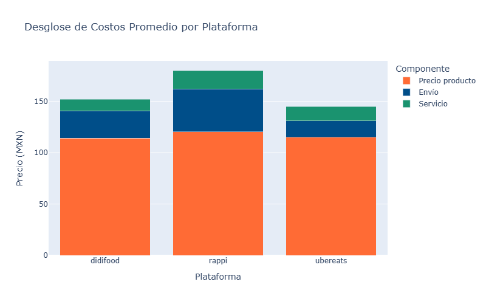
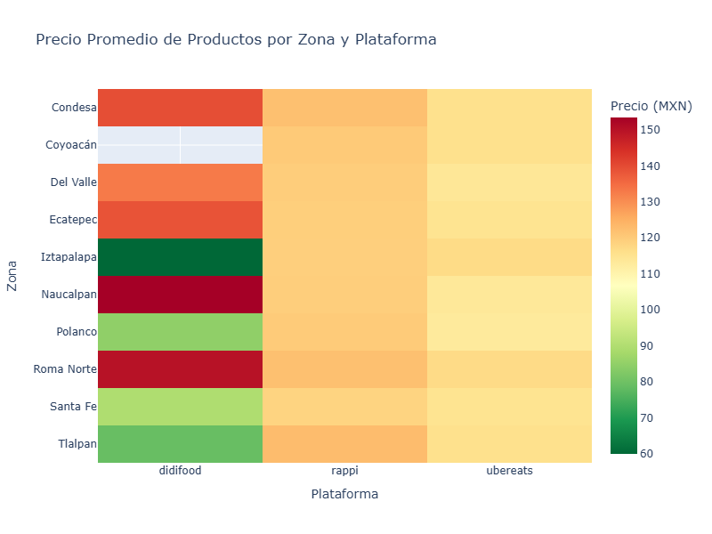
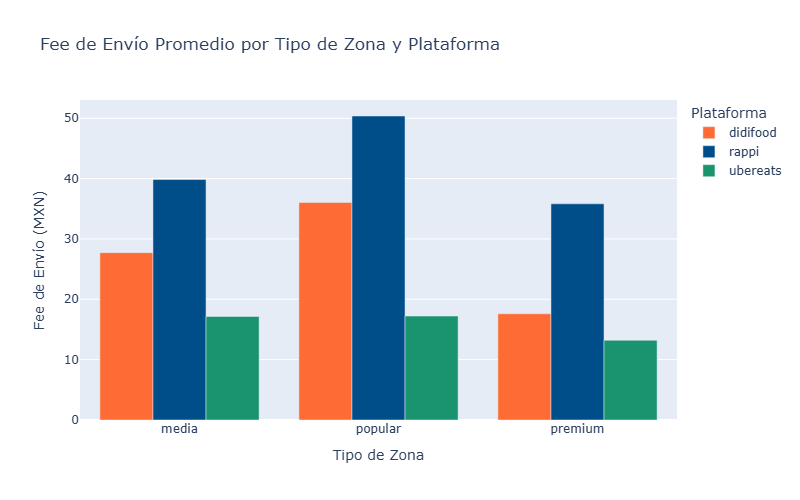

# Reporte de Inteligencia Competitiva — Delivery CDMX

**Fecha de generación:** 2026-03-27 14:16 UTC
**Datos recolectados:** 117/150 puntos de datos disponibles
**Plataformas:** rappi, ubereats, didifood
**Zonas monitoreadas:** 10

---

## Resumen Ejecutivo

### Métricas por Plataforma

| Plataforma | Precio Producto | Fee Envío | Fee Servicio | Total | Tiempo Entrega |
|:-----------|:---------------:|:---------:|:------------:|:-----:|:--------------:|
| didifood | $114.21 | $26.60 | $11.42 | $152.23 | 42 min |
| rappi | $120.28 | $41.79 | $18.04 | $180.11 | 37 min |
| ubereats | $115.13 | $15.99 | $13.82 | $144.94 | 32 min |

---

## Insights Estratégicos

### Insight 1: Diferencia de precio total entre plataformas

**Finding:** ubereats es la plataforma más económica con un costo total promedio de $144.94 MXN, mientras que rappi es 24.3% más cara ($180.11 MXN).

**Impact:** Los consumidores sensibles al precio migrarán hacia la plataforma más barata, especialmente en zonas populares.

**Recommendation:** Rappi debería evaluar su estructura de precios contra el líder en costo para mantener competitividad.

### Insight 2: Peso de fees sobre precio total en didifood

**Finding:** En didifood, los fees (envío + servicio) representan ~25.0% del costo total del pedido.

**Impact:** Fees altos reducen la conversión de usuarios que comparan plataformas antes de ordenar.

**Recommendation:** Implementar estrategias de absorción de fees (membresías, mínimos de compra) para mejorar percepción de valor.

### Insight 3: Diferenciación de precios por zona socioeconómica

**Finding:** Los precios en zonas premium son 2.7% más altos que en zonas populares.

**Impact:** La diferenciación geográfica de precios indica estrategias de pricing dinámico basadas en disposición a pagar.

**Recommendation:** Analizar elasticidad de demanda por zona para optimizar precios sin sacrificar volumen.

### Insight 4: Velocidad de entrega como diferenciador competitivo

**Finding:** ubereats ofrece los tiempos de entrega más rápidos (32 min promedio).

**Impact:** Los tiempos de entrega influyen directamente en la satisfacción y retención de usuarios.

**Recommendation:** Invertir en optimización logística (dark stores, rutas inteligentes) en zonas con tiempos altos.

### Insight 5: Cobertura geográfica de plataformas

**Finding:** rappi tiene la mejor cobertura (100%) mientras que didifood cubre solo 34% de las zonas monitoreadas.

**Impact:** Zonas sin cobertura representan oportunidad de mercado no capturada.

**Recommendation:** Expandir cobertura en zonas populares donde la demanda potencial es alta pero la oferta es limitada.

---

## Visualizaciones

### Desglose de costos por plataforma

### Heatmap de precios por zona

### Fees por tipo de zona

---

## Metodología

- **Herramientas:** Python + Scrapling (stealth browser) + Pandas + Plotly
- **Rate limiting:** 3s entre requests, máx. 3 reintentos, timeout 30s
- **Zonas:** 10 direcciones representativas de CDMX (premium, media, popular)
- **Productos:** 5 items de McDonald's como benchmark
- **Ética:** User-Agent transparente, sin saturación de servidores, uso exclusivo para reclutamiento
